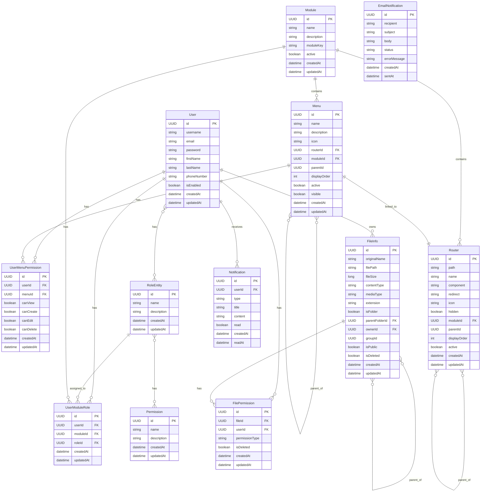

# Lược đồ cơ sở dữ liệu (ERD)

## Tổng quan

Lược đồ cơ sở dữ liệu của dự án bao gồm các entity chính sau:

### User Service
- User: Quản lý thông tin người dùng
- RoleEntity: Quản lý vai trò trong hệ thống
- Permission: Quản lý quyền hạn
- Module: Quản lý các module trong hệ thống
- Menu: Quản lý menu trong hệ thống
- Router: Quản lý router trong hệ thống
- UserModuleRole: Quản lý vai trò của người dùng trong từng module
- UserMenuPermission: Quản lý quyền của người dùng đối với từng menu

### File Service
- FileInfo: Quản lý thông tin file và thư mục
- FilePermission: Quản lý quyền truy cập file

### Notification Service
- Notification: Quản lý thông báo cho người dùng
- EmailNotification: Quản lý thông báo qua email

## Biểu đồ ERD



## Mô tả chi tiết các entity

## User Service

### User

```
User {
    UUID id (PK)
    String username
    String email
    String password
    String firstName
    String lastName
    String phoneNumber
    boolean isEnabled
    Set<RoleEntity> roles
    Set<UserModuleRole> moduleRoles
    LocalDateTime createdAt
    LocalDateTime updatedAt
}
```

### RoleEntity

```
RoleEntity {
    UUID id (PK)
    String name
    String description
    Set<Permission> permissions
    Set<User> users
    LocalDateTime createdAt
    LocalDateTime updatedAt
}
```

### Permission

```
Permission {
    UUID id (PK)
    String name
    String description
    Set<RoleEntity> roles
    LocalDateTime createdAt
    LocalDateTime updatedAt
}
```

### Module

```
Module {
    UUID id (PK)
    String name
    String description
    String moduleKey
    boolean active
    LocalDateTime createdAt
    LocalDateTime updatedAt
}
```

### Menu

```
Menu {
    UUID id (PK)
    String name
    String description
    String icon
    Router router (FK)
    Module module (FK)
    UUID parentId
    Integer displayOrder
    boolean active
    boolean visible
    LocalDateTime createdAt
    LocalDateTime updatedAt
}
```

### Router

```
Router {
    UUID id (PK)
    String path
    String name
    String component
    String redirect
    String icon
    boolean hidden
    Module module (FK)
    UUID parentId
    Integer displayOrder
    boolean active
    LocalDateTime createdAt
    LocalDateTime updatedAt
}
```

### UserModuleRole

```
UserModuleRole {
    UUID id (PK)
    User user (FK)
    Module module (FK)
    RoleEntity role (FK)
    LocalDateTime createdAt
    LocalDateTime updatedAt
}
```

### UserMenuPermission

```
UserMenuPermission {
    UUID id (PK)
    User user (FK)
    Menu menu (FK)
    boolean canView
    boolean canCreate
    boolean canEdit
    boolean canDelete
    LocalDateTime createdAt
    LocalDateTime updatedAt
}
```

## File Service

### FileInfo

```
FileInfo {
    UUID id (PK)
    String originalName
    String filePath
    Long fileSize
    String contentType
    String mediaType
    String extension
    boolean isFolder
    UUID parentFolderId (FK)
    UUID ownerId (FK)
    UUID groupId
    boolean isPublic
    boolean isDeleted
    Set<FilePermission> permissions
    LocalDateTime createdAt
    LocalDateTime updatedAt
}
```

### FilePermission

```
FilePermission {
    UUID id (PK)
    FileInfo file (FK)
    UUID userId (FK)
    PermissionType permissionType (ENUM: READ, WRITE, DELETE)
    boolean isDeleted
    LocalDateTime createdAt
    LocalDateTime updatedAt
}
```

## Notification Service

### Notification

```
Notification {
    UUID id (PK)
    UUID userId (FK)
    NotificationType type (ENUM)
    String title
    String content
    boolean read
    LocalDateTime createdAt
    LocalDateTime readAt
}
```

### EmailNotification

```
EmailNotification {
    UUID id (PK)
    String recipient
    String subject
    String body
    EmailStatus status (ENUM: PENDING, SENT, FAILED)
    String errorMessage
    LocalDateTime createdAt
    LocalDateTime sentAt
}
```

## Mối quan hệ giữa các entity

### User Service

1. **User - RoleEntity**: Quan hệ nhiều-nhiều (Many-to-Many)
   - Một User có thể có nhiều Role
   - Một Role có thể được gán cho nhiều User

2. **RoleEntity - Permission**: Quan hệ nhiều-nhiều (Many-to-Many)
   - Một Role có thể có nhiều Permission
   - Một Permission có thể thuộc về nhiều Role

3. **User - Module - RoleEntity**: Quan hệ nhiều-nhiều-nhiều thông qua UserModuleRole
   - Một User có thể có nhiều Role trong nhiều Module khác nhau
   - Một Module có thể có nhiều User với các Role khác nhau
   - Một Role có thể được gán cho nhiều User trong nhiều Module khác nhau

4. **Module - Menu**: Quan hệ một-nhiều (One-to-Many)
   - Một Module có thể có nhiều Menu
   - Một Menu chỉ thuộc về một Module

5. **Module - Router**: Quan hệ một-nhiều (One-to-Many)
   - Một Module có thể có nhiều Router
   - Một Router chỉ thuộc về một Module

6. **Menu - Router**: Quan hệ một-một (One-to-One)
   - Một Menu có thể liên kết với một Router
   - Một Router có thể được liên kết với một Menu

7. **User - Menu**: Quan hệ nhiều-nhiều thông qua UserMenuPermission
   - Một User có thể có quyền đối với nhiều Menu
   - Một Menu có thể được phân quyền cho nhiều User

8. **Menu - Menu**: Quan hệ đệ quy (Recursive)
   - Một Menu có thể là menu cha của nhiều Menu con (parentId)

9. **Router - Router**: Quan hệ đệ quy (Recursive)
   - Một Router có thể là router cha của nhiều Router con (parentId)

### File Service

10. **FileInfo - FileInfo**: Quan hệ đệ quy (Recursive)
    - Một FileInfo (folder) có thể chứa nhiều FileInfo con khác (thông qua trường parentFolderId)

11. **FileInfo - User**: Quan hệ nhiều-một (Many-to-One)
    - Nhiều FileInfo có thể thuộc về một User (thông qua trường ownerId)

12. **FileInfo - FilePermission**: Quan hệ một-nhiều (One-to-Many)
    - Một FileInfo có thể có nhiều FilePermission
    - Một FilePermission chỉ thuộc về một FileInfo

13. **FilePermission - User**: Quan hệ nhiều-một (Many-to-One)
    - Nhiều FilePermission có thể thuộc về một User (thông qua trường userId)

### Notification Service

14. **Notification - User**: Quan hệ nhiều-một (Many-to-One)
    - Nhiều Notification có thể thuộc về một User (thông qua trường userId)

15. **EmailNotification**: Đây là một entity độc lập không có quan hệ trực tiếp với các entity khác trong hệ thống.